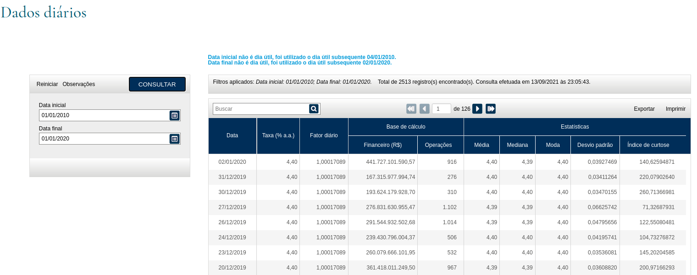

# Desafio 02

Bem-vindo ao Desafio n° 02 da [Ideal](http://www.tideal.com.br/). Esse repositório ficará disponível para receber o seu 
PR até `2021-10-31T23:59:59-03:00`.

### Objetivo

Imagine que você agora faz parte do nosso equipe de desenvolvimento. Como parte do seu primeiro desafio você deve 
desenvolver uma ferramenta simples de consulta à taxa [SELIC](https://www.bcb.gov.br/controleinflacao/taxaselic), para 
que os operadores e despachantes aduaneiros possam ter acesso de forma fácil e rápida a essa informação.

### Exemplo

Abaixo temos um exemplo da ferramenta de consulta do Banco Central, você também pode acessar [aqui](https://www.bcb.gov.br/htms/SELIC/SELICdiarios.asp?frame=1)

Nós disponibilizamos um arquivo [**JSON**](proposta/seu-nome/data.json) com as informações no período de 01/01/2010 a 
01/01/2020, conforme a pesquisa na ferramenta.

### Proposta

**Como** Despachante Aduaneiro, constantemente **preciso** consultar os valores retroativos da Taxa Selic. Algumas vezes
preciso consultar por um determinado período (data inicial e data final), outras vezes preciso consultar uma mesma 
data (DD/MM) do ano em anos específicos. **Para então** analisar e poder preencher outros documentos.

### Requisitos Funcionais

- **Deve** ser possível consultar a taxa SELIC a partir de um período informado.
- **Deve** ser possível consultar a taxa SELIC a partir de uma data específica em um ano;
- **Deve** ser possível consultar a taxa SELIC a partir de uma data específica entre um ou mais anos;
- **Deve** exibir uma notificação caso a data ou período informado estiver fora do range 01/01/2010 a 01/01/2020;
- **Não deve** ser possível inserir caracteres **não numéricos** na data ou período;

### Critérios de Aceite

- A solução deve ser totalmente reproduzível no ambiente `docker-compose.yml`;
- A solução deve usar [Vue.js](https://vuejs.org/);
- Utilize SASS para criar as folhas de estilos necessárias;
- Você deve criar um script de build, ele deve ser executado a partir do comando yarn build conforme o `package.json`;
- Compacte o melhor possível a solução;
- Evite requisições desnecessárias;
- Consulta toda a informação a partir do arquivo `data.json`;

### Critérios de Avaliação

- Forma de iteração com a solução;
- Fontes que facilitem a leitura das informações;
- Tamanho da solução;
- Quantidade de requisições;
- Uso do SASS;
- Responsividade no layout;
- Componentização e reusabilidade;
- SOLID no JS;
- Domínio no uso do Vue.js;
- Aplicação de boas práticas;
- Criatividade;
- Melhora da experiência na atividade proposta;
- Clareza no código;

### Bônus

- Implemente as funcionalidade de exportar e imprimir;
- Utilizar alguma ferramenta de teste, unitária, funcional, integração ou e2e;
- Integrar o projeto com alguma ferramenta de CI;

### Como enviar

- Crie um fork do projeto;
- Altere o nome do diretório `proposta/seu-nome` incluindo o seu nome no formato `lowercase` usando hífen (`-`) quando 
necessário;
- Utilize o ambiente `docker-compose.yml`;
- Altere o que for necessário no arquivo `package.json` para criar a sua solução, apenas garanta que ele continue
compatível com arquivo `docker-compose.yml`;
- Crie os arquivos que achar necessário;
- Ao final, utilize alguma técnica conhecida por você para realizar o `squash dos seus commits` em 1 commit.
- Envie o `PULL-REQUEST`;
- Esperamos que você se divirta e aprenda algo fazendo esse desafio. Se não conseguir algum detalhe, pode nos mandar 
mesmo assim, que avaliaremos com todo o prazer (e talvez possamos-lhe auxiliar no que faltou).