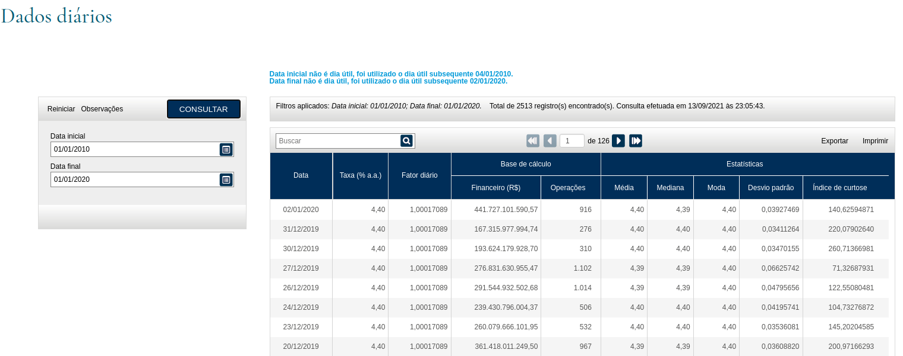

# Projeto Front-end Vue.JS consumindo API via JSON 
## Desafio 2 - Master
<p>
Hoje estou muito feliz porque em fim terminei o desafio 2  da empresa Ideal TI.
</p>
<p>
Quando me propuseram este desafio, confeso que estava com receio, pois não tinha muito conhecimento em SASS, Docker e apenas dois projetos em Vue.JS, porem mesmo assim decidi desafiar a mim mesmo.  
</P>
<br>

<p>Imagem da proposta.</p>
<br>
<p>Segui a lógica propósta, porém fiz algumas mudanças no Layout, esse foi o resultado final</p>
<br>

<br>
<h2>Tecnologias Usadas:</h2><br>
<h3>Front-end</h3>
<p>
- Vue.JS <br>
- JavaScript <br>
- SASS <br>
- AXIOS (para requisição a API)
</p><br>
<h3>Back-end</h3>
<p>
- Node.JS <br>
- Express <br>
- JSON
</p>

<h2>Como dar o Start </h2>
<p>Entre na pasta <strong>"proposta"</strong> e em seguida na pasta<strong>"back-end"</strong> e no <i>Terminal</i> digite os seguintes comandos:</p>
<p>Para instalar as dependencias</p>

```
npm install
```
<br>
<p>Para rodar o projeto</p>

```
npm start
```
<br>
<p>Depois é necessário entrar na pasta <strong>front-end</strong> :</p>
<p>Para intalar as dependencias do Projeto</p>

```
npm install
```
<br>
<p>Para rodar o projeto</p>

```
npm run serve
```

<p>Pronto! Agora já estamos com o projeto rodando na nossa máquina local</p>
<br>
<p>Entre em: http://localhost:8080/</p>

